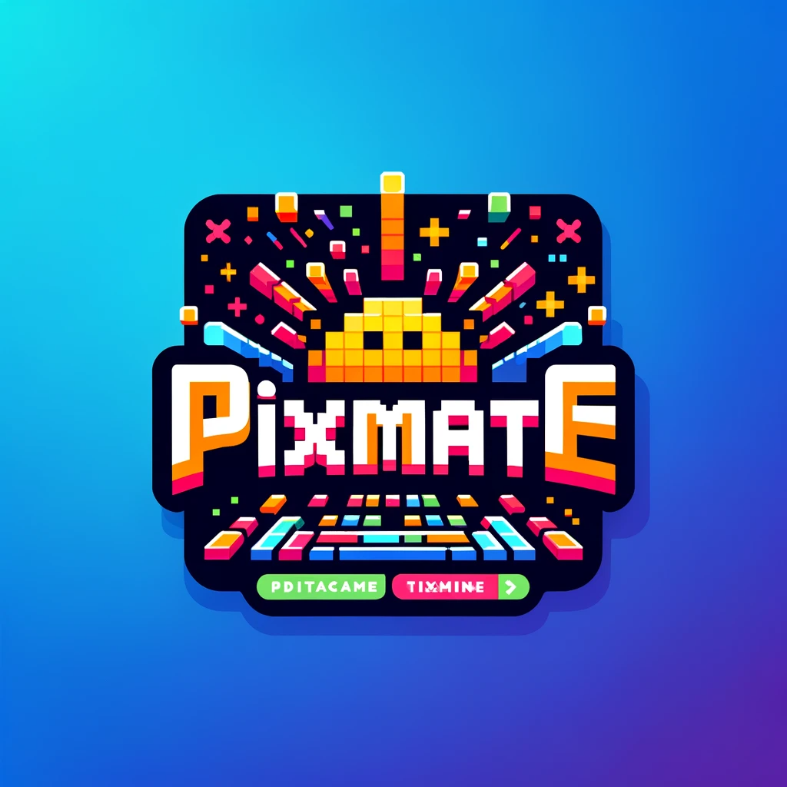
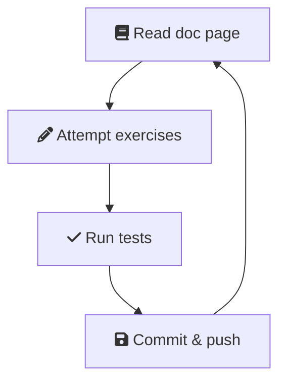

<p align="center">
</img>
</p>

# PixMate

Welcome to PixMate!

The purpose of this repo is to make pixel art. We'll be using everything we've
learned so far, including arrays, strings and conditionals, along with a new
concept: loops.

```txt
     *
    ###
   *****
  #######
 *********
    ...
    ...
```

## Getting started

1. Make sure you have node, npm and git installed.

1. Clone the repo so you have it locally.

1. Run `npm init` to install the dependencies.

With all this done, you're ready for the deep dive!

## Deep dive



To draw our pixel art, we'll be using lots of loops! Today's deep dive is all
about loops, so let's get into it.

### `while` loops

1. Read the docs on [while loops]().

1. Complete Exercise 1a:

   - You'll find it in `exercises/1a.js`.

   - Run `npm run test:1a` in the terminal to see if you got it right!

   - Once you pass the tests, type `git commit -am "Solves 1a"` in the terminal
     and hit enter to commit your solution.

   - Now type `git push` to sync your changes to github.

1. Do the same for Exercise 1b.

### `for` loops

1. Read the docs on [for loops]().

1. Solve, commit and push Exercise 2a.

1. Solve, commit and push Exercise 2b.

### Common problems with loops

1. Read the docs on [common problems using loops]().

1. Solve, commit and push Exercise 2a.

1. Solve, commit and push Exercise 2b.

## Moving on

Great job! With the deep dive taken care of, we're ready to make some art.

Find `CONTRIBUTING.md` to find out what to do.
