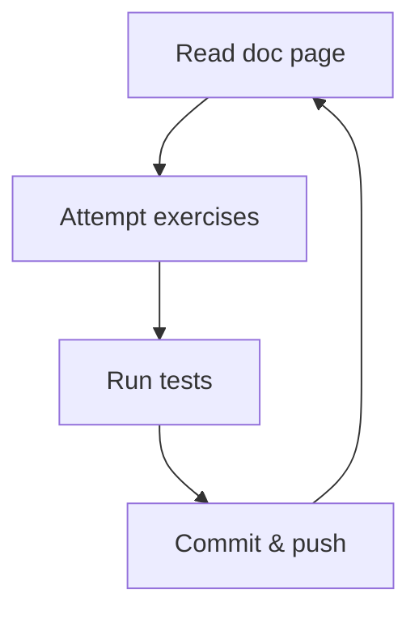

<p align="center">
  </img>
</p>

# PixMate

Welcome to PixMate!

The purpose of this repo is to make pixel art. We'll be using everything we've
learned so far, including arrays, strings and conditionals, along with a new
concept: loops.

```txt
     *
    ###
   *****
  #######
 *********
    ...
    ...
```

## Getting started

1. Make sure your machine is set up according to the instructions with

   - [bash](https://tech-docs.corndel.com/bash/)
   - [vscode](https://tech-docs.corndel.com/vscode/)
   - [git](https://tech-docs.corndel.com/git/)
   - [node & npm](https://tech-docs.corndel.com/js/installation.html)

1. Clone the repository (i.e. download it), so you have a copy on your machine.

1. Once cloned, open a terminal in the project folder, and run

   ```bash
   npm install
   ```

   to install dependencies.

## Running tests

You can test exercises individually using commands like

```bash
npm run test:1a
```

or you can run all tests at once using

```bash
npm run test
```

## Deep dive

Before working on PixMate, there are a few things we need to learn. There are
some documentation pages which will teach you what you need to know, and some
exercises for you to practice your skills.



### Basic loops

1. Read the docs on
   [while loops](https://tech-docs.corndel.com/js/while-loops.html) and
   [for loops](https://tech-docs.corndel.com/js/for-loops.html).

1. Complete Exercise 1a:

   - You'll find it in `exercises/1a.js`.

   - Run `npm run test:1a` in the terminal to see if you got it right!

   - Once you pass the tests, type `git commit -am "Solves 1a"` in the terminal
     and hit enter to commit your solution.

   - Now run `git push` to sync your changes to github.

1. Read the docs on
   [for of loops](https://tech-docs.corndel.com/js/for-of-loops.html).

1. Solve, commit and push Exercise 1b.

### Loop control flow

1. Read the docs on
   [control flow](https://tech-docs.corndel.com/js/loop-control-flow.html).

1. Solve, commit and push Exercise 2a.

1. Solve, commit and push Exercise 2b.

### Nested loops

1. Read the docs on
   [applied iteration](https://tech-docs.corndel.com/js/nested-loops.html).

1. Solve, commit and push Exercise 3.

## Moving on

Great job! With the deep dive taken care of, we're ready to make some art.

Find `CONTRIBUTING.md` to find out what to do.
